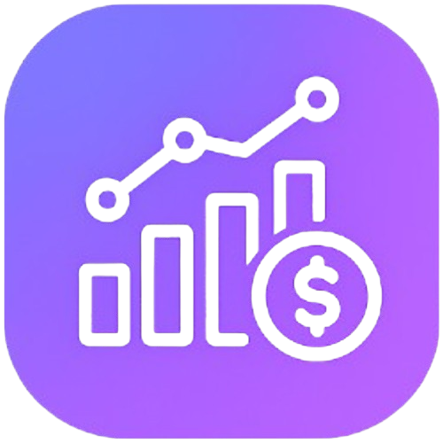

# 💰 FinTrack

<p align="center">
  
</p>

<p align="center">
  Sistema completo de gestão financeira pessoal desenvolvido com HTML, CSS e JavaScript.
</p>

<p align="center">
  
  
  
  
</p>

---

## 🚀 Sobre o Projeto

O FinTrack é uma aplicação web para controle financeiro pessoal que permite registrar receitas e despesas, acompanhar o saldo mensal, visualizar gráficos detalhados e monitorar a evolução financeira ao longo do tempo.

O objetivo do projeto é fornecer uma ferramenta moderna, intuitiva e eficiente para auxiliar no planejamento financeiro.

---

## ✨ Funcionalidades

### 💸 Gestão Financeira
- Cadastro de receitas
- Cadastro de despesas
- Edição e exclusão de lançamentos
- Controle de saldo mensal

### 📊 Dashboard Inteligente
- Total gasto
- Total recebido
- Saldo disponível
- Percentual da receita utilizada

### 🏷️ Categorias Personalizadas
- Criação de categorias
- Escolha de cores
- Seleção de ícones
- Organização automática dos lançamentos

### 📈 Relatórios e Análises
- Gráfico de distribuição de gastos
- Comparação entre meses
- Evolução histórica financeira
- Indicadores de desempenho

### 🎯 Planejamento Financeiro
- Definição de metas de economia
- Acompanhamento do progresso
- Alertas de gastos excessivos

### ⚙️ Recursos Extras
- Tema Claro/Escuro
- Importação de dados CSV
- Exportação de dados
- Armazenamento local (LocalStorage)
- Interface responsiva

---

## 🌟 Destaques

- Dashboard financeiro moderno e responsivo
- Controle completo de receitas e despesas
- Gráficos interativos com Chart.js
- Comparação financeira entre períodos
- Sistema de metas de economia
- Categorias personalizadas
- Tema claro e escuro
- Persistência de dados via LocalStorage

---

## 🛠️ Tecnologias Utilizadas

- HTML5
- CSS3
- JavaScript (Vanilla JS)
- Chart.js
- Lucide Icons
- LocalStorage

---

## 📂 Estrutura do Projeto

```text
FinTrack
│
├── index.html
├── style.css
├── app.js
├── icon.png
└── README.md
```

---

## 📸 Preview

### 📊 Dashboard Principal

<p align="center">
  
</p>

### 📈 Comparação Mensal

<p align="center">
  
</p>

### 🏷️ Gerenciamento de Categorias

<p align="center">
  
</p>

### 📉 Evolução Financeira

<p align="center">
  
</p>

## 🌐 Demonstração

Acesse o projeto online:

https://gabriel17gos.github.io/FinTrack/

## ▶️ Como Executar

Clone o repositório:

```bash
git clone https://github.com/gabriel17gos/FinTrack.git
```

Entre na pasta:

```bash
cd FinTrack
```

Abra o arquivo:

```bash
index.html
```

ou utilize a extensão Live Server do VS Code.

---

## 🎯 Objetivo

Este projeto foi desenvolvido para praticar conceitos de:

- Manipulação do DOM
- Programação JavaScript
- Gerenciamento de estado
- Visualização de dados
- Design responsivo
- Controle de versão com Git e GitHub

---

## 👨‍💻 Autor

Gabriel Oliveira

🐙 GitHub:
https://github.com/gabriel17gos

📂 Projeto:
https://github.com/gabriel17gos/FinTrack
